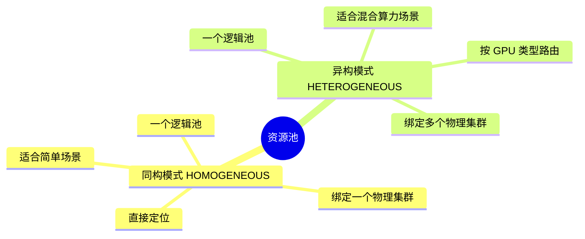
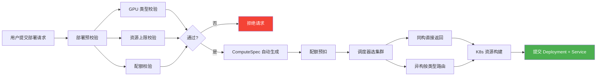
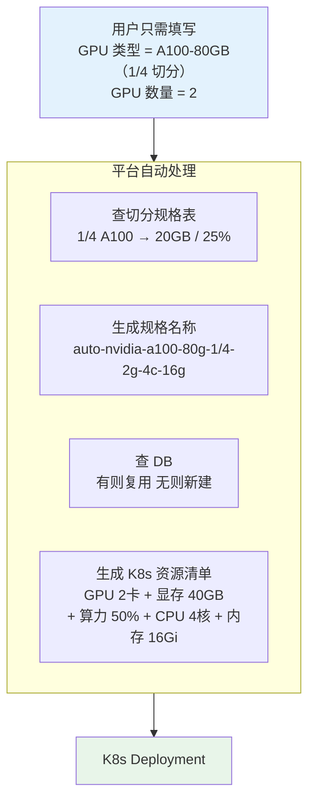
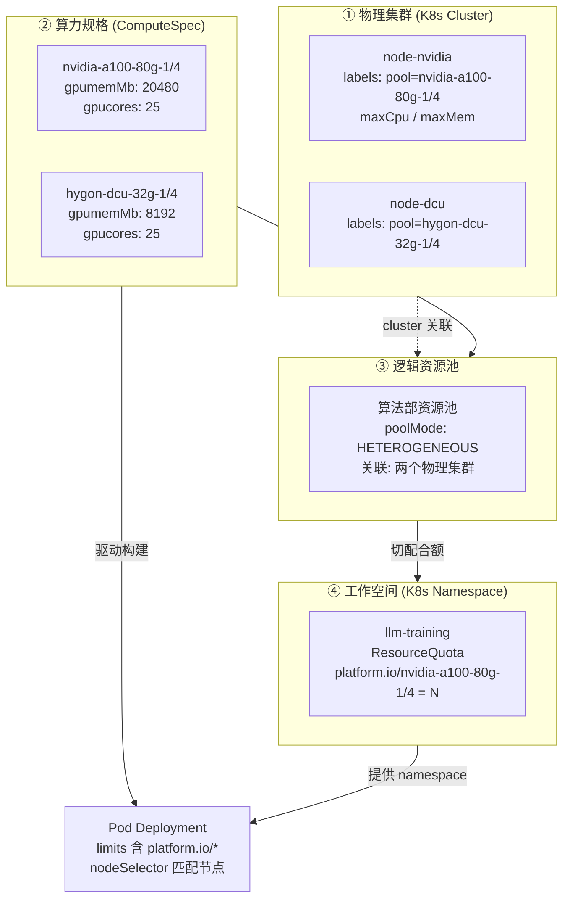
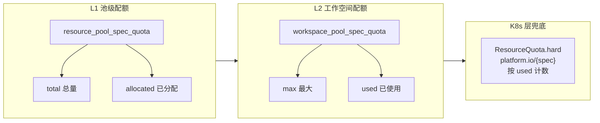
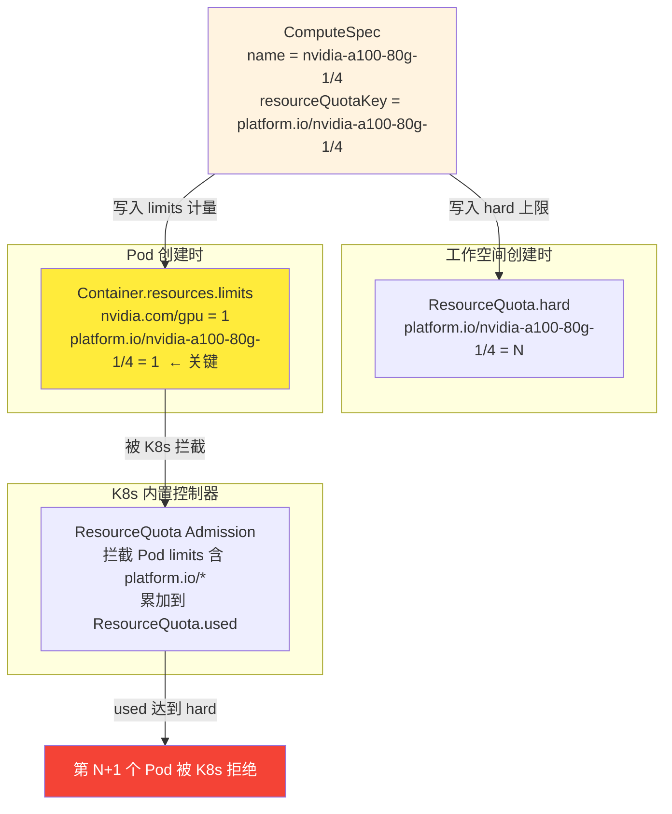
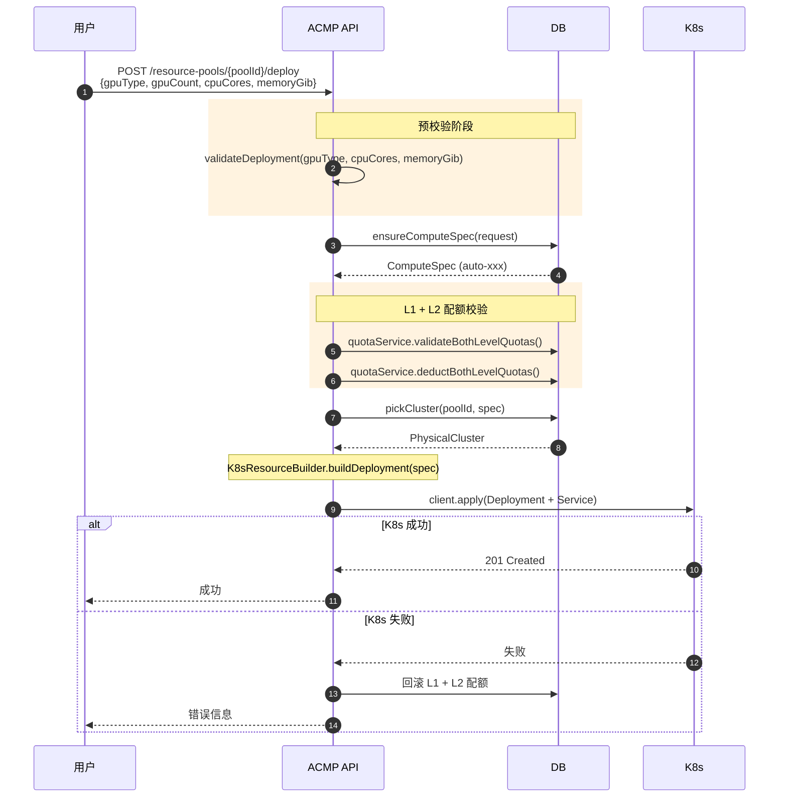
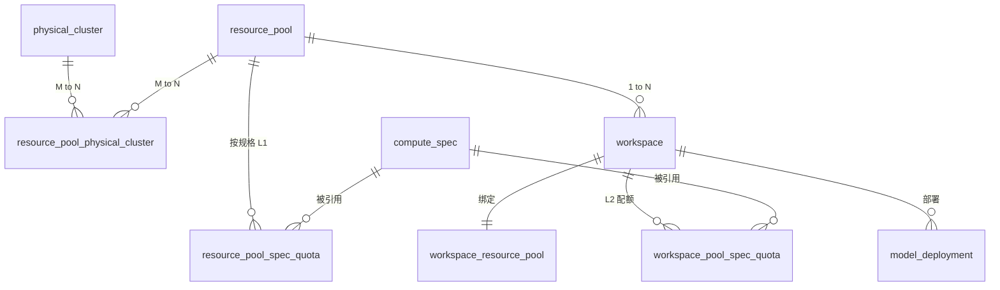

# ACMP 异构算力管理平台 — 原理思维导图

> 演示场景：用一图讲清楚"这个平台到底是什么、靠什么工作、隔离链如何打通"。
> 所有图采用 Mermaid 语法，GitHub/VSCode/Typora/Obsidian 均可直接渲染。

---

## 1. 一句话定位

> **ACMP = K8s 原生对象的"语义化包装层"。**
> 平台不发明新调度器，而是把"用户、部门、规格、配额"翻译成 K8s 已经能听懂的对象。

---

## 2. 系统设计七模块

```mermaid
mindmap
  root((ACMP<br/>异构算力管理平台))
    模块一<br/>资源池管理
      逻辑资源池
        面向用户的配额单元
        定义池基本信息
        支持规格类型
        不创建 K8s 资源
      物理集群
        实际 K8s Cluster
        节点标签（GPU 类型）
        污点配置
        资源上限
      同构模式
        一个逻辑池
        绑定一个物理集群
      异构模式
        一个逻辑池
        绑定多个物理集群
        按 GPU 类型路由
    模块二<br/>部署服务
      ComputeSpec
        资源规格模板
        存储在 DB
        每副本资源配置
      用户只需指定
        GPU 类型
        GPU 数量
      平台自动推导
        显存大小
        算力比例
        CPU / 内存
      规格名称规则
        auto-{GPU类型}
        -{GPU数量}g
        -{CPU}c
        -{内存}g
    模块三<br/>调度器模式
      同构调度器
        直接定位唯一集群
        GPU 类型校验
      异构调度器
        按 GPU 类型路由
        遍历集群匹配标签
      统一接口
        pickCluster
        validateDeployment
    模块四<br/>部署预校验
      第一重
        GPU 类型校验
        是否在池支持范围
      第二重
        CPU 上限校验
        内存上限校验
      第三重
        L1 池级配额
        L2 工作空间配额
      错误前置
        校验失败
        提前拒绝
        不扣配额
    模块五<br/>配额管理
      L1 池级配额
        resource_pool_spec_quota
        total 总量
        allocated 已分配
      L2 工作空间配额
        workspace_pool_spec_quota
        max 最大
        used 已使用
      双层校验
        先扣 L1
        再扣 L2
      双层释放
        逐层回滚
    模块六<br/>K8s 资源构建
      ComputeSpec
        翻译为 K8s 资源
      生成内容
        Deployment
          limits
            nvidia.com/gpu
            nvidia.com/gpumem
            nvidia.com/gpucores
            cpu / memory
            platform.io/{spec}
        nodeSelector
        tolerations
        Service
      提交目标
        物理集群
        Namespace
    模块七<br/>节点管理
      节点扫描
        获取节点信息
        GPU 类型 / 卡数
        显存 / 算力
        CPU / 内存
        支持的切分规格
      自动同步
        填充资源上限
        maxCpuCores
        maxMemoryGib
      前端展示
        供用户选择
        资源池支持类型
```

---

## 3. 资源池两种模式



---

## 4. 部署流程总览



---

## 5. 用户视角：极简输入



---

## 6. 三层资源模型



---

## 7. 双层配额体系



---

## 8. 隔离链关键 — ResourceQuota 真生效



---

## 9. 部署时序



---

## 10. 数据模型



---

## 11. 演示讲稿建议（3 分钟串词）

> 1. **定位**（30 秒）：平台是 K8s 原生对象的语义化包装层，不发明新调度器，把"用户、规格、配额"翻译成 K8s 能听懂的对象。
> 2. **结构**（60 秒）：七模块设计 — 资源池管理（同构/异构）/ 部署服务（ComputeSpec 自动生成）/ 调度器模式 / 部署预校验 / 配额管理 / K8s 资源构建 / 节点管理。
> 3. **核心简化**（60 秒）：用户只告诉平台"要几张什么类型的卡"，平台自动查切分规格表算显存算力，生成 ComputeSpec，提交 K8s。
> 4. **隔离机制**（30 秒）：ResourceQuota 用 `platform.io/{spec}` 计量，Pod limits 必须带这个字段，K8s 内置 Admission 接管限流，超额由 API Server 拒绝。
> 5. **价值结句**：跨厂商、跨集群、跨部门，统一一套 API，统一一套配额。

---

## 12. 一图记住整个系统

```
                  ┌──────────────────────────────────────────────┐
                  │       ComputeSpec  (平台翻译中枢)             │
                  │                                              │
                  │  gpuBrand     → nvidia.com/gpu | amd.com/dcu │
                  │  gpumemMb     → nvidia.com/gpumem            │
                  │  gpucores     → nvidia.com/gpucores           │
                  │  nodeSelector → Pod.nodeSelector             │
                  │  tolerations  → Pod.tolerations               │
                  │  quotaKey     → platform.io/{name}            │
                  └─────────────────────┬────────────────────────┘
                                        │ 翻译
        ┌───────────────────────────────┼───────────────────────────────┐
        │                               │                               │
        ▼                               ▼                               ▼
  ┌──────────┐                  ┌──────────────┐                ┌──────────────┐
  │ 物理池   │ M:N              │ 逻辑池       │ 1:N            │ 工作空间      │
  │ Cluster  │ ◄─────────────── │ DB 聚合      │ ──────────────► │ Namespace    │
  │ labels   │                  │ poolMode     │                │ ResourceQuota │
  │ taints   │                  │ 同构/异构    │                │ platform.io/* │
  │ maxCpu   │                  │              │                │               │
  │ maxMem   │                  │              │                │               │
  └──────────┘                  └──────────────┘                └──────┬───────┘
                                                                       │
                                                                       ▼
                                                                ┌─────────────┐
                                                                │ Pod 任务     │
                                                                │ limits 含    │
                                                                │ platform.io  │
                                                                │ + nodeSelect │
                                                                │ + tolerate   │
                                                                └─────────────┘
```

---

### 渲染建议

- 在 VSCode 中安装 *Markdown Preview Mermaid Support*
- 演示时可用 [mermaid.live](https://mermaid.live) 把单图复制进去全屏
- 导出 PNG：`mmdc -i MINDMAP.md -o mindmap.png`（需要 `@mermaid-js/mermaid-cli`）