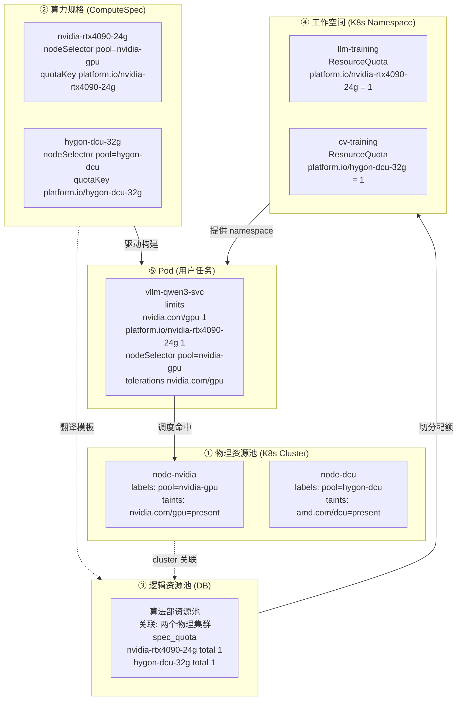
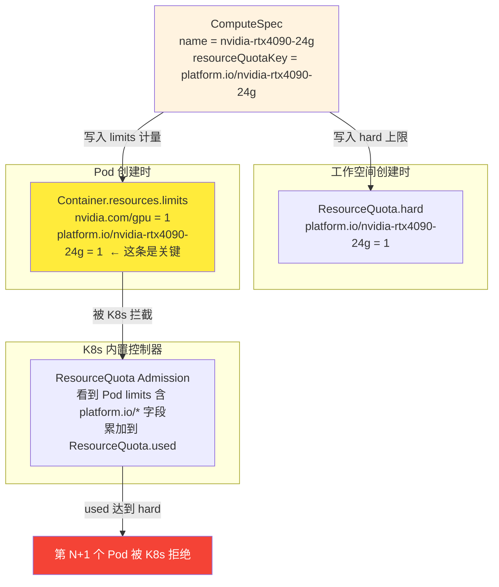
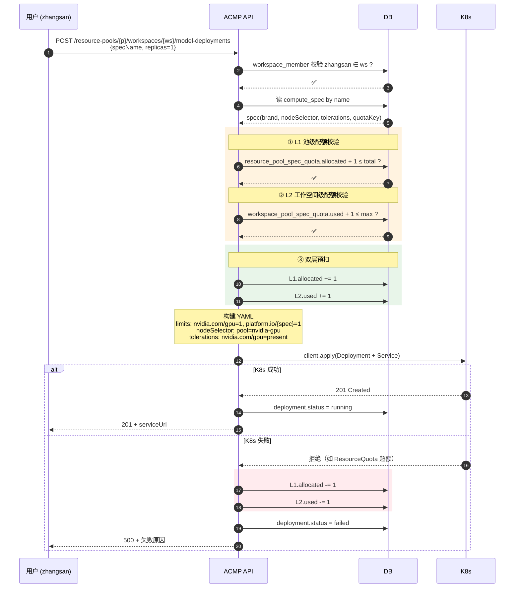
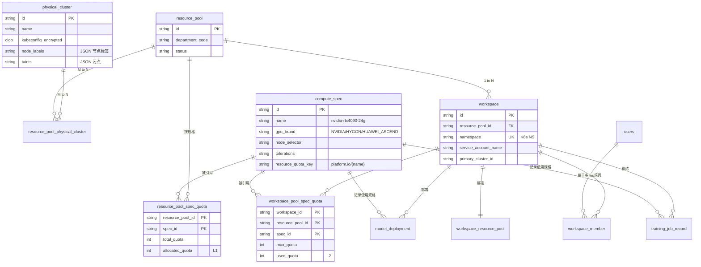
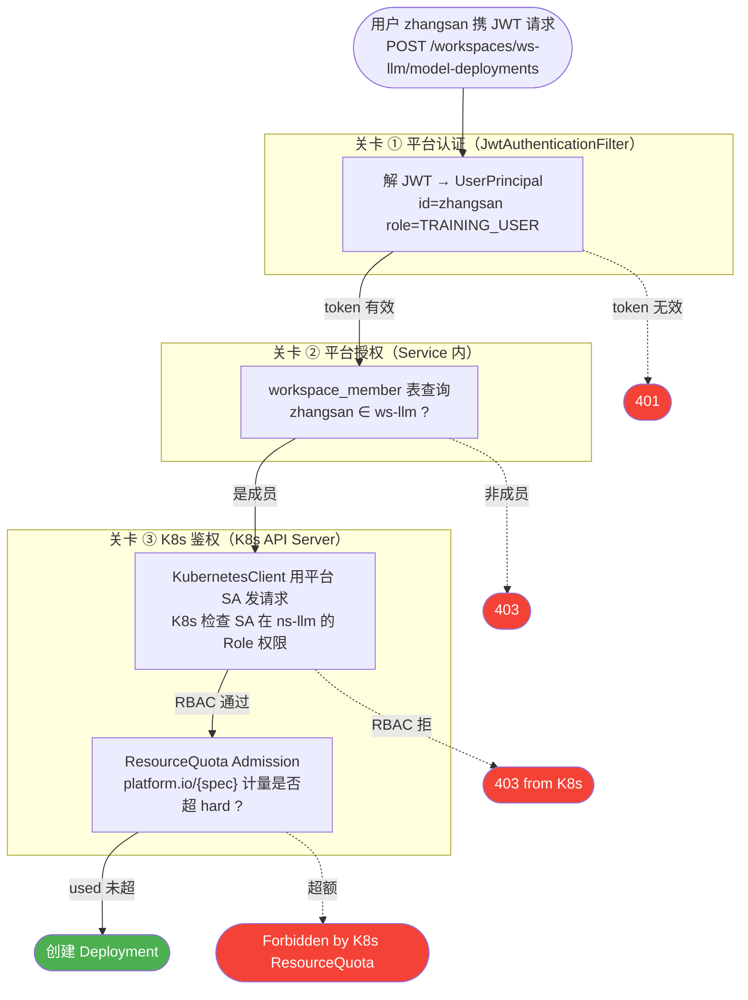
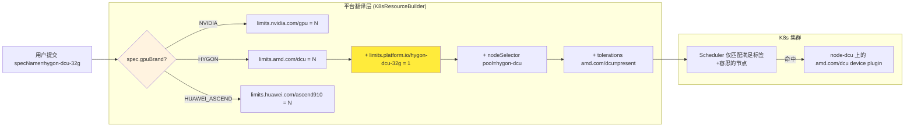

# ACMP 异构算力管理平台 — 原理思维导图

> 演示场景：用一图讲清楚"这个平台到底是什么、靠什么工作、隔离链如何打通"。
> 所有图采用 Mermaid 语法，GitHub/VSCode/Typora/Obsidian 均可直接渲染。

---

## 1. 一句话定位

> **ACMP = K8s 原生对象（Namespace / ResourceQuota / Node 标签污点 / RBAC / VolcanoQueue）的"语义化包装层"。**
> 平台不发明新调度器，而是把"用户、部门、规格、配额"翻译成 K8s 已经能听懂的对象。

---

## 2. 主思维导图（系统全景）

```mermaid
mindmap
  root((ACMP<br/>异构算力管理平台))
    设计哲学
      物理属性归物理池
      标准定义归规格
      逻辑池只存关联关系
      平台层代理 K8s 层 SA
      隔离收敛到 Namespace + ResourceQuota
    三层资源模型
      物理集群<br/>K8s Cluster
        Node + label + taint
        kubeconfig AES 加密存储
        总容量实时从 Node.allocatable 上报
      逻辑资源池<br/>纯 DB 聚合容器
        M to N 关联物理集群
        按规格 total quota 分配
        不创建任何 K8s 资源
      工作空间<br/>K8s Namespace
        1 to 1 Namespace
        ResourceQuota 按 platform.io 限流
        SA + Role + RoleBinding
        Volcano Queue
    算力规格 ComputeSpec
      gpuBrand
        NVIDIA → nvidia.com/gpu
        HYGON → amd.com/dcu
        HUAWEI_ASCEND → huawei.com/ascend910
      nodeSelector
        翻译为 Pod.nodeSelector
        用来选物理集群
      tolerations
        翻译为 Pod.tolerations
        穿透物理池污点
      resourceQuotaKey
        platform.io/{specName}
        让 ResourceQuota 真生效
    双层配额体系
      L1 池级
        resource_pool_spec_quota
        total / allocated
        防止部门超额
      L2 工作空间级
        workspace_pool_spec_quota
        max / used
        防止项目超额
      K8s 层兜底
        ResourceQuota.hard
        按 platform.io/spec 限 used
    权限链
      JWT 平台层认证
        UserPrincipal
        id role poolIds
      workspace_member 平台层授权
        校验 user 属于 workspace
      K8s SA 层鉴权
        1 ws 1 SA
        平台代理调用
        不建 per-user SA
    异构硬件抽象
      NVIDIA GPU
        device plugin
        HAMi vGPU
      Hygon DCU
        amd.com/dcu
      华为昇腾
        huawei.com/ascend910
    回滚保护
      部署失败 双层配额回退
      删除部署 释放 L2 used
      删除工作空间 释放 L1 allocated 并删 ns
```

---

## 3. 三层资源模型对照表



---

## 4. 资源量流转链路（9 步）

```mermaid
flowchart LR
    A[1 物理机上架<br/>kubectl label/taint node] --> B[2 注册物理集群<br/>POST /admin/physical-clusters]
    B --> C[3 定义算力规格<br/>POST /specs]
    C --> D[4 创建逻辑池<br/>POST /admin/resource-pools<br/>+ spec_quota.total]
    D --> E[5 创建工作空间<br/>POST /workspaces<br/>L1 校验 → 选集群 → K8s ns + ResourceQuota]
    E --> F[6 提交任务<br/>POST /model-deployments<br/>L1+L2 校验 → 预扣 → 注入 spec → K8s Deployment]
    F --> G[7 K8s Scheduler<br/>nodeSelector + taint 匹配节点]
    G --> H[8 Kubelet + Cgroup<br/>容器隔离 GPU 卡限制<br/>ResourceQuota.used += 1]
    H --> I[9 删除/失败<br/>双层配额回滚<br/>ResourceQuota.used -= 1]

    style A fill:#e3f2fd
    style E fill:#fff3e0
    style F fill:#fff3e0
    style I fill:#ffebee
```



---

## 5. 隔离链的关键 — "为什么 ResourceQuota 能真生效"



> **关键洞察**：旧实现只给 ResourceQuota 设了 `platform.io/{spec}=1`，但没给 Pod 加这个字段 → K8s 永远计 0 → 隔离失效。修复后 Pod limits 必须**同时**带 `platform.io/{spec}=1`，ResourceQuota 才会累加 used，超额时由 K8s **API Server 拒绝**新 Pod。

---

## 6. 双层配额工作时序（以部署为例）



---

## 7. 数据模型（精简 ER）



---

## 8. 权限链（三道关卡）



---

## 9. 异构硬件抽象（一图看懂"为啥能跨厂商"）



---

## 10. 演示讲稿建议（3 分钟串词）

> 1. **痛点**（30 秒）：企业有 NVIDIA、海光、昇腾混合卡，多个部门混着用，怎么"既隔离又共享"？
> 2. **结构**（60 秒）：用三层资源模型 — 物理池（K8s Cluster）/逻辑池（DB 聚合）/工作空间（K8s NS）。物理池存"硬件事实"，逻辑池存"分配契约"，工作空间是"团队的隔离边界"。
> 3. **关键发明**（60 秒）：算力规格（ComputeSpec）作为唯一翻译层 —— **任何用户请求只指定 specName，平台自动翻译成 K8s 标准对象**（设备资源键、节点选择器、容忍、计量键）。一处定义、处处对齐。
> 4. **隔离链怎么真生效**（30 秒）：ResourceQuota 用 `platform.io/{spec}` 而不是 `nvidia.com/gpu`，Pod limits 同样带这个键 —— **K8s 内置 ResourceQuota Admission 接管限流**，超额由 API Server 拒绝，平台无需自己实现"调度器"。
> 5. **价值结句**：跨厂商、跨集群、跨部门，统一一套 API，统一一套配额，统一一套权限。

---

## 11. 一图记住整个系统

```
                  ┌──────────────────────────────────────────────┐
                  │       ComputeSpec  (唯一翻译中枢)             │
                  │                                              │
                  │  gpuBrand     → nvidia.com/gpu | amd.com/dcu │
                  │  nodeSelector → Pod.nodeSelector             │
                  │  tolerations  → Pod.tolerations              │
                  │  quotaKey     → platform.io/{name}           │
                  └─────────────────────┬────────────────────────┘
                                        │ 翻译
        ┌───────────────────────────────┼───────────────────────────────┐
        │                               │                               │
        ▼                               ▼                               ▼
  ┌──────────┐                  ┌──────────────┐                ┌──────────────┐
  │ 物理池   │ M:N              │ 逻辑池       │ 1:N            │ 工作空间      │
  │ Cluster  │ ◄─────────────── │ DB 聚合      │ ──────────────► │ Namespace    │
  │ labels   │                  │ spec_quota   │                │ ResourceQuota │
  │ taints   │                  │ total /      │                │ platform.io/* │
  │          │                  │ allocated L1 │                │ used / hard   │
  └──────────┘                  └──────────────┘                └──────┬───────┘
                                                                       │
                                                                       ▼
                                                                ┌─────────────┐
                                                                │ Pod 任务     │
                                                                │ limits 含    │
                                                                │ platform.io  │
                                                                │ + nodeSelect │
                                                                │ + tolerate   │
                                                                └─────────────┘
```

---

### 渲染建议

- 在 VSCode 中安装 *Markdown Preview Mermaid Support*
- 演示时可用 [mermaid.live](https://mermaid.live) 把单图复制进去全屏
- 导出 PNG：`mmdc -i MINDMAP.md -o mindmap.png`（需要 `@mermaid-js/mermaid-cli`）
