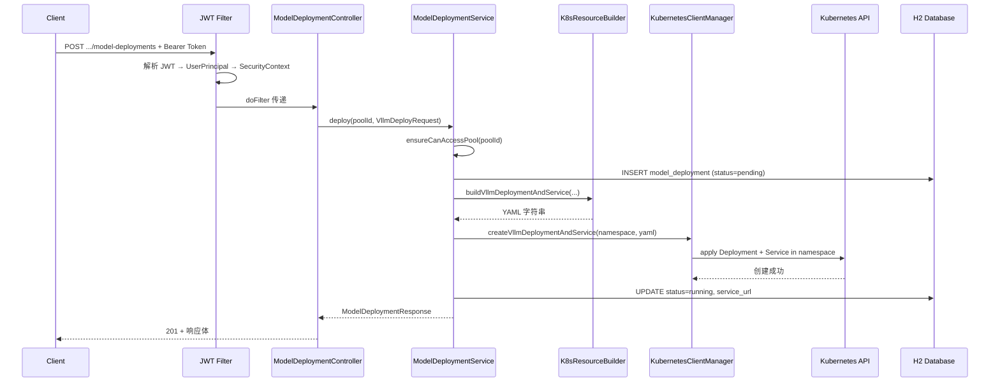

# ACMP-Compute 工程文档 V1

> **AI Compute Platform（异构算力管理平台）** — 基于 K8s + HAMi + Volcano 技术栈的显卡资源管理与任务调度平台。

---

## 目录

1. [工程概览](#1-工程概览)
2. [技术栈](#2-技术栈)
3. [核心概念与架构设计](#3-核心概念与架构设计)
4. [项目结构](#4-项目结构)
5. [数据库设计](#5-数据库设计)
6. [API 接口文档](#6-api-接口文档)
7. [核心模块详解](#7-核心模块详解)
8. [K8s 资源管理](#8-k8s-资源管理)
9. [安全模型](#9-安全模型)
10. [请求处理流程](#10-请求处理流程)
11. [配置说明](#11-配置说明)
12. [构建与部署](#12-构建与部署)
13. [v0.2 版本变更记录](#13-v02-版本变更记录)

---

## 1. 工程概览

### 1.1 定位

`acmp-compute` 是一个 **异构算力管理平台的后端服务**，提供 HTTP REST API，面向 AI 训练和推理场景。平台通过抽象「物理集群」和「逻辑资源池」两个概念，实现多 K8s 集群的统一管理和算力资源的池化分配。

### 1.2 核心能力

| 能力域 | 说明 |
|--------|------|
| **多集群管理** | 注册多个 K8s 物理集群，通过 kubeconfig 连接，AES 加密存储敏感凭证 |
| **资源池化** | 基于 K8s Namespace + ResourceQuota 实现部门级资源隔离，一一对应 Volcano Queue |
| **vLLM 推理部署** | 一键部署 vLLM 模型推理服务（Deployment + Service），支持 hostPath 挂载本地模型权重 |
| **Volcano 训练任务** | 提交 VolcanoJob 进行分布式 GPU 训练，支持 gang scheduling |
| **多租户权限** | JWT 认证 + 角色权限（PLATFORM_ADMIN / ORG_ADMIN / TRAINING_USER / INFERENCE_USER） |
| **凭证发放** | 为部门用户生成限定 namespace 的 kubeconfig，直接访问 K8s |

### 1.3 依赖的基础组件

| 组件 | 版本要求 | 用途 |
|------|---------|------|
| Kubernetes | 1.x | 底层资源编排 |
| HAMi | 任意 | GPU 共享 / vGPU 设备插件（提供 `nvidia.com/gpumem`、`nvidia.com/gpucores` 等扩展资源） |
| Volcano | 1.x | 批调度器（Queue + VolcanoJob + gang scheduling） |

---

## 2. 技术栈

| 层次 | 技术 | 版本 |
|------|------|------|
| 语言 | Java | 11 |
| 框架 | Spring Boot | 2.7.18 |
| 数据库 | H2 (文件模式) | — |
| ORM | MyBatis | 2.3.2 |
| K8s 客户端 | fabric8 Kubernetes Client | 6.13.0 |
| 模板引擎 | Freemarker | 2.3.x |
| 安全 | Spring Security + JWT (jjwt) | 0.11.5 |
| 加密 | AES-256 | — |
| 密码哈希 | BCrypt | strength=10 |
| 构建 | Maven | 3.8+ |

---

## 3. 核心概念与架构设计

### 3.1 概念层次

```
┌──────────────────────────────────────────────────────┐
│                    Platform (平台)                     │
│  ┌─────────────────────────────────────────────────┐ │
│  │           Physical Cluster (物理集群)            │ │
│  │   一个完整的 K8s 集群，通过 kubeconfig 连接       │ │
│  │  ┌─────────────────┐  ┌─────────────────┐        │ │
│  │  │ Resource Pool A  │  │ Resource Pool B  │       │ │
│  │  │ (逻辑资源池)      │  │ (逻辑资源池)      │      │ │
│  │  │ Namespace:       │  │ Namespace:       │       │ │
│  │  │ dept-ai-abc123   │  │ dept-biz-def456  │       │ │
│  │  │ ResourceQuota    │  │ ResourceQuota     │      │ │
│  │  │ Volcano Queue    │  │ Volcano Queue     │      │ │
│  │  │ SA + Role + RB   │  │ SA + Role + RB   │       │ │
│  │  └─────────────────┘  └─────────────────┘        │ │
│  └─────────────────────────────────────────────────┘ │
└──────────────────────────────────────────────────────┘
```

### 3.2 物理集群 (PhysicalCluster)

代表一个真实的 K8s 集群。平台通过管理员提交的 `kubeconfig` 文件连接该集群，并对其中的资源进行操作。每个物理集群可包含多个逻辑资源池。

**关键字段：**
- `kubeconfigBase64Encrypted`：AES-256 加密后的 kubeconfig 内容
- `status`：active / degraded / offline

### 3.3 逻辑资源池 (ResourcePool)

**一个逻辑资源池 = K8s 侧的一组隔离资源**，包含：

| K8s 资源 | 作用 |
|----------|------|
| **Namespace** | 命名隔离，命名规则 `dept-{departmentCode}-{8位随机ID}` |
| **ResourceQuota** | 限制 GPU/CPU/Memory/Pods 总量 |
| **ServiceAccount** | 部门级服务账号，命名规则 `sa-dept-{departmentCode}` |
| **Role** | 部门级权限（Pod/Deployment/Job/VolcanoJob/Service/ConfigMap/Secret/PVC/Event） |
| **RoleBinding** | 绑定 SA 到 Role |
| **Volcano Queue** | 队列级资源配额与调度策略，命名规则 `queue-dept-{departmentCode}` |

逻辑资源池与部门（业务单位）一一对应。`departmentCode` 用于生成上述 K8s 资源名称。

### 3.4 HAMi 在本项目中的角色

HAMi 是 GPU 共享 / vGPU 设备插件，提供 `nvidia.com/gpumem`（显存）、`nvidia.com/gpucores`（算力）等扩展资源。

**本项目不直接配置 HAMi**，只在 Pod/VolcanoJob 的 `resources.limits` 中声明这些资源名。HAMi 的 device plugin 和调度扩展需在集群侧预装。

### 3.5 Volcano 在本项目中的角色

- **Queue**：每个逻辑资源池对应一个 Volcano Queue，`spec.capability` 与资源池容量一致
- **VolcanoJob**：训练任务以 VolcanoJob 形式提交，指定 `schedulerName: volcano` 和 `queue`，实现 gang scheduling
- **vLLM 推理**：使用标准 K8s Deployment + Service，不使用 Volcano

---

## 4. 项目结构

```
acmp-compute/
├── Dockerfile                          # 多阶段构建（Maven → JRE）
├── pom.xml                             # Maven 依赖配置
├── README.md                           # 原 README
├── docs/
│   ├── DEPLOY.md                       # Docker 部署说明
│   ├── EXAMPLE-REQUEST.md              # HTTP 请求示例 + curl 命令
│   ├── HAMI-VOLCANO.md                 # HAMi/Volcano 定位与关系
│   ├── MODEL-AND-IMAGES.md             # 模型与镜像本地化说明
│   ├── REQUEST-FLOW.md                 # 请求处理流程图
│   └── v0.2/                           # v0.2 版本变更文档
│       ├── BUILDER-API-*.md            # Builder API 迁移相关文档
│       ├── MIGRATION-GUIDE.md          # 迁移指南
│       └── ...
└── src/main/
    ├── java/com/acmp/compute/
    │   ├── AcmpComputeApplication.java # Spring Boot 启动类
    │   ├── config/
    │   │   ├── SecurityConfig.java     # Spring Security + JWT + CORS 配置
    │   │   └── InstantTypeHandler.java # MyBatis Instant ↔ Timestamp 转换
    │   ├── controller/
    │   │   ├── AuthController.java     # 登录认证
    │   │   ├── PhysicalClusterController.java  # 物理集群 CRUD
    │   │   ├── ResourcePoolController.java     # 逻辑资源池 CRUD
    │   │   ├── ModelDeploymentController.java  # vLLM 模型部署
    │   │   ├── TrainingJobController.java      # 训练任务提交
    │   │   └── AdminController.java            # 管理员专用 API
    │   ├── dto/                        # 请求/响应 DTO（12 个）
    │   ├── entity/                     # 数据库实体（8 个）
    │   ├── exception/
    │   │   ├── GlobalExceptionHandler.java     # 全局异常处理
    │   │   ├── ForbiddenException.java         # 权限异常
    │   │   └── ResourceNotFoundException.java  # 资源不存在异常
    │   ├── k8s/
    │   │   ├── KubernetesClientManager.java    # K8s 客户端管理（缓存、CRUD）
    │   │   ├── K8sTemplateEngine.java          # Freemarker 模板渲染引擎
    │   │   └── K8sResourceBuilder.java         # fabric8 Builder API 构建 K8s 资源
    │   ├── mapper/                     # MyBatis Mapper 接口（7 个）
    │   ├── security/
    │   │   ├── JwtTokenProvider.java           # JWT 生成/解析
    │   │   ├── JwtAuthenticationFilter.java    # JWT 认证过滤器
    │   │   ├── UserPrincipal.java              # 用户主体（实现 UserDetails）
    │   │   └── Role.java                       # 角色枚举
    │   └── service/
    │       ├── UserService.java                # 用户 + 登录
    │       ├── EncryptionService.java          # AES 加解密
    │       ├── PhysicalClusterService.java     # 物理集群管理
    │       ├── ResourcePoolService.java        # 逻辑资源池管理
    │       ├── ModelDeploymentService.java     # vLLM 模型部署
    │       ├── TrainingJobService.java         # 训练任务提交
    │       ├── AdminPhysicalClusterService.java  # 管理员物理集群注册
    │       └── AdminResourcePoolService.java   # 管理员资源池操作（凭证发放）
    └── resources/
        ├── application.yml                     # 应用配置
        ├── schema-h2.sql                       # H2 数据库建表 DDL
        ├── data-h2.sql                         # 初始数据（admin 用户）
        ├── k8s-templates/                      # Freemarker 模板（.ftl）
        │   ├── resource-quota.yaml.ftl
        │   ├── vllm-deployment.yaml.ftl
        │   ├── volcano-job.yaml.ftl
        │   └── volcano-queue.yaml.ftl
        ├── k8s-templates-example/              # 模板渲染后的参考 YAML
        │   ├── resource-quota-example.yaml
        │   └── vllm-deployment-example.yaml
        └── mapper/                             # MyBatis XML 映射文件（7 个）
```

---

## 5. 数据库设计

### 5.1 表结构一览

| 表名 | 说明 | 核心字段 |
|------|------|---------|
| `physical_cluster` | 物理 K8s 集群 | id, name, description, kubeconfig_base64_encrypted, status |
| `organization` | 组织 | id, name |
| `resource_pool` | 逻辑资源池 | id, physical_cluster_id, name, department_code, department_name, namespace, service_account_name, gpu_slots, cpu_cores, memory_gib, max_pods, volcano_queue_name, status |
| `users` | 用户 | id, username, password_hash, role, organization_id |
| `user_resource_pool` | 用户-资源池关联 (M2M) | user_id, resource_pool_id |
| `model_deployment` | vLLM 部署记录 | id, resource_pool_id, name, model_name, model_source, model_id_or_path, vllm_image, gpu_per_replica, gpumem_mb, gpucores, replicas, k8s_deployment_name, k8s_service_name, status, service_url, created_by |
| `training_job_record` | 训练任务记录 | id, resource_pool_id, k8s_job_name, job_name, status, created_by |
| `resource_pool_credential` | 资源池凭证 | id, resource_pool_id, username, kubeconfig, expire_at |

### 5.2 实体关系 (ER)

```
physical_cluster 1 ──── N resource_pool
resource_pool    1 ──── N model_deployment
resource_pool    1 ──── N training_job_record
resource_pool    1 ──── N resource_pool_credential
resource_pool    N ──── M users  (via user_resource_pool)
organization     1 ──── N users
```

### 5.3 初始数据

- 默认组织：`org-default` / `Default Org`
- 默认管理员：`admin` / `admin123`（BCrypt 哈希），角色：`PLATFORM_ADMIN`

---

## 6. API 接口文档

### 6.1 认证接口

| 方法 | 路径 | 权限 | 说明 |
|------|------|------|------|
| POST | `/api/v1/auth/login` | 公开 | 用户名密码登录，返回 JWT |

**请求体：**
```json
{"username": "admin", "password": "admin123"}
```

**响应体：**
```json
{
  "token": "eyJhbGciOiJIUzI1NiJ9...",
  "username": "admin",
  "role": "PLATFORM_ADMIN",
  "expiresInMs": 86400000
}
```

### 6.2 物理集群接口

| 方法 | 路径 | 权限 | 说明 |
|------|------|------|------|
| POST | `/api/v1/physical-clusters` | PLATFORM_ADMIN | 注册物理集群 |
| GET | `/api/v1/physical-clusters` | PLATFORM_ADMIN | 列出所有集群 |
| GET | `/api/v1/physical-clusters/{id}/capacity` | 认证用户 | 查询集群 GPU/CPU/Memory 容量 |
| DELETE | `/api/v1/physical-clusters/{id}` | PLATFORM_ADMIN | 删除集群 |

### 6.3 逻辑资源池接口

| 方法 | 路径 | 权限 | 说明 |
|------|------|------|------|
| POST | `/api/v1/resource-pools` | PLATFORM_ADMIN / ORG_ADMIN | 创建逻辑资源池（自动创建 Namespace + ResourceQuota + RBAC + Volcano Queue） |
| GET | `/api/v1/resource-pools` | PLATFORM_ADMIN / ORG_ADMIN | 列出所有资源池 |
| GET | `/api/v1/resource-pools/{id}` | 认证用户 (需有该池权限) | 查询资源池详情 |
| PATCH | `/api/v1/resource-pools/{id}/capacity` | PLATFORM_ADMIN / ORG_ADMIN | 修改资源池容量 |

### 6.4 vLLM 模型部署接口

| 方法 | 路径 | 权限 | 说明 |
|------|------|------|------|
| POST | `/api/v1/resource-pools/{poolId}/model-deployments` | 有该 pool 权限的用户 | 部署 vLLM 模型服务 |
| GET | `/api/v1/resource-pools/{poolId}/model-deployments` | 有该 pool 权限的用户 | 列出部署 |
| GET | `/api/v1/resource-pools/{poolId}/model-deployments/{deploymentId}` | 有该 pool 权限的用户 | 查询部署状态（含 K8s readyReplicas） |
| DELETE | `/api/v1/resource-pools/{poolId}/model-deployments/{deploymentId}` | 有该 pool 权限的用户 | 删除部署 |

### 6.5 训练任务接口

| 方法 | 路径 | 权限 | 说明 |
|------|------|------|------|
| POST | `/api/v1/resource-pools/{poolId}/training-jobs` | 有该 pool 权限的用户 | 提交 VolcanoJob 训练任务 |

### 6.6 管理员专用接口

| 方法 | 路径 | 权限 | 说明 |
|------|------|------|------|
| POST | `/api/v1/admin/physical-clusters` | PLATFORM_ADMIN | 注册物理集群（带 Base64 解码校验） |
| POST | `/api/v1/admin/resource-pools` | PLATFORM_ADMIN | 创建部门逻辑资源池 |
| POST | `/api/v1/admin/resource-pools/{poolId}/issue-credential` | PLATFORM_ADMIN | 为部门用户发放 K8s 访问凭证（kubeconfig） |

---

## 7. 核心模块详解

### 7.1 安全模块 (`security/`)

#### JwtTokenProvider
- 使用 HMAC-SHA 签名生成 JWT
- Claims 包含：`userId(sub)`, `username`, `role`, `organizationId`, `resourcePoolIds`
- 密钥和过期时间通过 `application.yml` 配置

#### JwtAuthenticationFilter
- 继承 `OncePerRequestFilter`，在每次请求时解析 `Authorization: Bearer <token>`
- 解析后构造 `UserPrincipal` 并放入 `SecurityContextHolder`
- 解析失败不阻断请求（由后续 `SecurityConfig` 鉴权）

#### UserPrincipal
- 实现 `UserDetails`，包含 `id`, `username`, `role`, `resourcePoolIds`
- `canAccessPool(poolId)` 方法：PLATFORM_ADMIN 可访问所有池，其他用户仅可访问已分配的池

#### Role 枚举
- `PLATFORM_ADMIN`：平台管理员
- `ORG_ADMIN`：组织管理员
- `TRAINING_USER`：训练用户
- `INFERENCE_USER`：推理用户

### 7.2 K8s 客户端管理 (`k8s/`)

#### KubernetesClientManager
核心职责：
- **客户端缓存**：`ConcurrentHashMap<String, KubernetesClient>`，按 physicalClusterId 缓存
- **kubeconfig 管理**：从数据库取加密的 kubeconfig → 解密 → 创建客户端
- **资源操作**：
  - `createNamespace()` / `createResourceQuota()` / `createServiceAccount()`
  - `createRole()` / `createRoleBinding()`
  - `applyYamlInNamespace()` / `applyClusterScopedYaml()`
  - `createVllmDeploymentAndService()` / `deleteDeployment()` / `deleteService()`
  - `getDeploymentReadyReplicas()`
  - `extractServiceAccountCredentials()`
  - `validateKubeconfig()`
- **Role 权限定义**：Pod(log/exec), Deployment, StatefulSet, Job, VolcanoJob, Service, ConfigMap, Secret, Event, PVC

#### K8sTemplateEngine
- 基于 Freemarker 渲染 `k8s-templates/` 下的 `.ftl` 模板
- 从 classpath 加载模板

#### K8sResourceBuilder
- 使用 **fabric8 Builder API**（非 Freemarker 模板）构建 K8s 资源
- 三个核心方法：
  - `buildVllmDeploymentAndService()`：构建 vLLM Deployment + Service YAML，含 nodeSelector、资源限制、hostPath volume、readinessProbe
  - `buildVolcanoJob()`：使用 Unstructured API 构建 VolcanoJob YAML（apiVersion: `batch.volcano.sh/v1alpha1`）
  - `buildVolcanoQueue()`：构建 Volcano Queue YAML（apiVersion: `scheduling.volcano.sh/v1beta1`）

### 7.3 加密服务 (`EncryptionService`)

- 算法：AES-256（需要 32 字节密钥）
- `encrypt(plainText)` → Base64 编码密文（存库）
- `decrypt(base64Encrypted)` → 明文（使用前解密 kubeconfig）
- 密钥默认值：`acmp32byteskey!!!!!!!!!!!!!!!!!!`（生产环境必须通过 `AES_KEY` 环境变量覆盖）

### 7.4 服务层 (`service/`)

| 服务 | 核心职责 |
|------|---------|
| **UserService** | 实现 `UserDetailsService`，加载用户 + 关联 resourcePoolIds；`login()` 校验密码并返回 JWT |
| **PhysicalClusterService** | 注册集群（校验 kubeconfig → 加密 → 存库 → 缓存）；容量查询（遍历节点 allocatable）；删除（关闭客户端 + 删库） |
| **ResourcePoolService** | 创建资源池（7 步：Namespace → ResourceQuota → SA → Role → RoleBinding → Volcano Queue → DB）；列表/查询/容量修改 |
| **ModelDeploymentService** | vLLM 部署（权限校验 → 写记录 pending → 构建 YAML → K8s apply → 更新 running/serviceUrl）；查询状态（含 K8s readyReplicas）；删除（K8s 资源 + DB） |
| **TrainingJobService** | VolcanoJob 提交（权限校验 → Builder API 构建 YAML → K8s apply） |
| **AdminPhysicalClusterService** | 管理员注册物理集群（Base64 解码 kubeconfig → 校验连通性 → 加密存储） |
| **AdminResourcePoolService** | 凭证发放（提取 SA token/CA → 构建限定 namespace 的 kubeconfig） |

---

## 8. K8s 资源管理

### 8.1 资源创建顺序（资源池创建时）

```
1. Namespace           → dept-{departmentCode}-{8位随机}
2. ResourceQuota       → quota-dept-{departmentCode} (gpu/cpu/memory/pods)
3. ServiceAccount      → sa-dept-{departmentCode}
4. Role                → role-dept-{departmentCode} (8 类资源权限)
5. RoleBinding         → rb-dept-{departmentCode} (绑定 SA → Role)
6. Volcano Queue       → queue-dept-{departmentCode} (集群级 CRD)
7. DB INSERT           → resource_pool 表
```

### 8.2 vLLM Deployment 资源声明

Pod 模板使用以下资源限制（与 HAMi 兼容）：

```yaml
resources:
  limits:
    nvidia.com/gpu: "2"           # GPU 数量
    nvidia.com/gpumem: "8192"     # 显存 (MiB)，HAMi 设备
    nvidia.com/gpucores: "100"    # GPU 算力占比，HAMi 设备
  requests:
    nvidia.com/gpu: "2"
```

节点选择器：`gpu-node: "true"` — 强制调度到 GPU 节点。

### 8.3 模型权重挂载

- **有权重 (with_weights)**：镜像内含权重 或 hostPath/PVC 挂载
- **无权重 (without_weights)**：仅运行时镜像，必须 `hostModelPath` 挂载
- `hostModelPath` 以 `hostPath` Volume 类型挂载到容器内 `/models` 路径

### 8.4 双 Builder 策略

项目同时保留：
1. **Freemarker 模板** (`k8s-templates/*.ftl`)：供 `K8sTemplateEngine` 渲染，保持向后兼容
2. **fabric8 Builder API** (`K8sResourceBuilder`)：v0.2 新增，提供类型安全和编译时检查

当前实际调用路径使用 `K8sResourceBuilder`（Builder API），Freemarker 模板作为参考保留。

---

## 9. 安全模型

### 9.1 认证流程

```
Client → POST /api/v1/auth/login → UserService.login()
  → BCrypt 校验密码
  → JwtTokenProvider.generateToken(userId, username, role, resourcePoolIds)
  → 返回 LoginResponse(token, username, role, expiresInMs)

后续请求 → Authorization: Bearer <token>
  → JwtAuthenticationFilter.doFilterInternal()
  → 解析 claims → 构造 UserPrincipal → SecurityContextHolder
```

### 9.2 授权模型

| 接口 | 权限要求 |
|------|---------|
| 物理集群 CRUD | `@PreAuthorize("hasRole('PLATFORM_ADMIN')")` |
| 资源池创建/列表 | `@PreAuthorize("hasRole('PLATFORM_ADMIN') or hasRole('ORG_ADMIN')")` |
| 资源池查询 | 代码内 `canAccessPool()` 校验 |
| vLLM 部署 | `canAccessPool()` 校验 |
| 训练任务 | `canAccessPool()` 校验 |
| 管理员 API | 类级 `@PreAuthorize("hasRole('PLATFORM_ADMIN')")` |

`canAccessPool()` 逻辑：PLATFORM_ADMIN 可访问所有池；其他角色只能访问 JWT claims 中 `resourcePoolIds` 包含的池。

### 9.3 SecurityConfig

- CSRF 禁用
- Session 无状态 (`STATELESS`)
- CORS 允许所有来源（生产需收紧）
- H2 控制台允许 iframe（`frameOptions().sameOrigin()`）
- 白名单：`/api/v1/auth/login`, `/h2-console/**`, `/actuator/health`

---

## 10. 请求处理流程

### 10.1 vLLM 部署流程



### 10.2 训练任务提交流程

```
Client → JWT Filter → TrainingJobController → TrainingJobService.submit()
  → canAccessPool() 校验
  → K8sResourceBuilder.buildVolcanoJob()
  → KubernetesClientManager.applyYamlInNamespace()
  → K8s API: create VolcanoJob
  → 返回 { jobName, message: "已提交" }
```

### 10.3 资源池创建流程

```
Client → ResourcePoolController.create()
  → ResourcePoolService.create(request)
  → [7 步原子操作]
    1. 校验物理集群存在
    2. 生成资源名 (namespace, sa, role, rb, quota, queue)
    3. createNamespace()
    4. createResourceQuota() (含 maxPods)
    5. createServiceAccount()
    6. createRole() (8 类权限)
    7. createRoleBinding()
    8. buildVolcanoQueue() + applyClusterScopedYaml()
    9. INSERT resource_pool
  → 返回 ResourcePoolResponse
```

---

## 11. 配置说明

### 11.1 application.yml 关键配置

```yaml
server:
  port: 8080

spring:
  datasource:
    url: jdbc:h2:file:./data/acmp;DB_CLOSE_DELAY=-1;AUTO_SERVER=TRUE

jwt:
  secret: ${JWT_SECRET:acmp-compute-jwt-secret-key-change-in-production}
  expiration-ms: 86400000    # 24 小时

encryption:
  aes-key: ${AES_KEY:acmp32byteskey!!!!!!!!!!!!!!!!!!}  # 必须 32 字节
```

### 11.2 环境变量

| 变量 | 说明 | 默认值 |
|------|------|--------|
| `JWT_SECRET` | JWT 签名密钥 | `acmp-compute-jwt-secret-key-change-in-production` |
| `AES_KEY` | AES 加密密钥（必须 32 字节） | `acmp32byteskey!!!!!!!!!!!!!!!!!!` |

---

## 12. 构建与部署

### 12.1 本地运行

```bash
cd acmp-compute-platform/acmp-compute
mvn spring-boot:run
```

- 服务端口：`8080`
- H2 控制台：`http://localhost:8080/h2-console`
  - JDBC URL: `jdbc:h2:file:./data/acmp`
  - 用户名：`sa`，密码：空

### 12.2 Docker 构建与运行

```bash
# 构建
docker build -t acmp-compute:latest .

# 运行
docker run -d -p 8080:8080 \
  -e JWT_SECRET=your-secret \
  -e AES_KEY=acmp32byteskey!!!!!!!!!!!!!!!!! \
  --name acmp-compute \
  acmp-compute:latest
```

Dockerfile 使用多阶段构建：
1. **builder 阶段**：Maven 3.8 + Temurin 11，执行 `mvn package -DskipTests`
2. **运行阶段**：Temurin 11 JRE Alpine，以 `appuser` 用户运行

### 12.3 数据持久化（可选）

```bash
docker run -d -p 8080:8080 \
  -v $(pwd)/data:/app/data \
  -e JWT_SECRET=... -e AES_KEY=... \
  acmp-compute:latest
```

---

## 13. v0.2 版本变更记录

v0.2 版本的核心变更是引入 **fabric8 Builder API** 作为 K8s 资源构建的主要方式：

| 变更项 | 说明 |
|--------|------|
| **K8sResourceBuilder** | 新增静态 Builder 类，使用 fabric8 Builder API 构建 K8s 资源，替代部分 Freemarker 模板渲染 |
| **Builder API 优势** | 类型安全、编译时检查、IDE 自动补全、无需维护字符串模板 |
| **Freemarker 模板保留** | `k8s-templates/*.ftl` 与 `K8sTemplateEngine` 保留作为参考，保持向后兼容 |
| **AdminController** | 新增管理员专用 API（物理集群注册、资源池创建、凭证发放） |
| **AdminPhysicalClusterService** | 独立的管理员集群注册服务，含 Base64 解码 + kubeconfig 校验 |
| **AdminResourcePoolService** | 凭证发放服务：从 SA Secret 提取 token/CA，构建限定 namespace 的 kubeconfig |
| **ResourcePool 增强** | 新增 `departmentCode`、`departmentName`、`maxPods`、`serviceAccountName` 字段 |
| **ResourceQuota 增强** | 新增 `pods` 限制 |
| **RBAC 增强** | 创建 Role（8 类资源权限）+ RoleBinding，替代简单的 RBAC 配置 |
| **节点选择器** | Deployment 和 VolcanoJob 均添加 `nodeSelector: gpu-node: "true"` |
| **readinessProbe** | vLLM Deployment 添加 HTTP 就绪探针 (`/health:8000`) |
| **volcano-queue.yaml.ftl** | 新增 Volcano Queue 模板 |

详细变更文档见 `docs/v0.2/` 目录。

---

## 附录：快速操作指南

### A. 从零开始的完整流程

```bash
# 1. 启动服务
mvn spring-boot:run

# 2. 登录获取 Token
TOKEN=$(curl -s -X POST http://localhost:8080/api/v1/auth/login \
  -H "Content-Type: application/json" \
  -d '{"username":"admin","password":"admin123"}' | jq -r '.token')

# 3. 注册物理集群
CLUSTER_ID=$(curl -s -X POST http://localhost:8080/api/v1/physical-clusters \
  -H "Authorization: Bearer $TOKEN" \
  -H "Content-Type: application/json" \
  -d '{"name":"my-k8s","kubeconfigBase64":"<base64_kubeconfig>"}' | jq -r '.id')

# 4. 创建逻辑资源池
POOL_ID=$(curl -s -X POST http://localhost:8080/api/v1/resource-pools \
  -H "Authorization: Bearer $TOKEN" \
  -H "Content-Type: application/json" \
  -d "{\"physicalClusterId\":\"$CLUSTER_ID\",\"name\":\"AI研发池\",\"departmentCode\":\"ai\",\"departmentName\":\"AI研发部\",\"gpuSlots\":8,\"cpuCores\":48,\"memoryGiB\":256}" | jq -r '.id')

# 5. 部署 vLLM 模型服务
curl -s -X POST "http://localhost:8080/api/v1/resource-pools/$POOL_ID/model-deployments" \
  -H "Authorization: Bearer $TOKEN" \
  -H "Content-Type: application/json" \
  -d '{"name":"qwen3-svc","modelName":"Qwen3","modelSource":"with_weights","modelIdOrPath":"/models","vllmImage":"vllm/vllm-openai:latest","gpuPerReplica":2,"replicas":1,"hostModelPath":"/data/models/Qwen3"}'

# 6. 提交训练任务
curl -s -X POST "http://localhost:8080/api/v1/resource-pools/$POOL_ID/training-jobs" \
  -H "Authorization: Bearer $TOKEN" \
  -H "Content-Type: application/json" \
  -d '{"jobName":"train-demo","image":"nvcr.io/nvidia/pytorch:24.08-py3","replicas":2,"gpuPerPod":1,"command":["python","train.py"]}'
```

---

> **文档版本**：V1  
> **生成日期**：2026-05-26  
> **基于代码版本**：acmp-compute 1.0.0-SNAPSHOT
