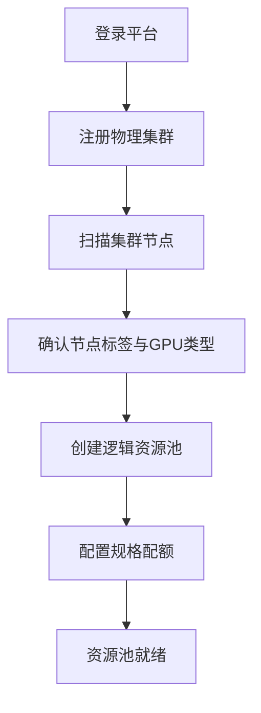
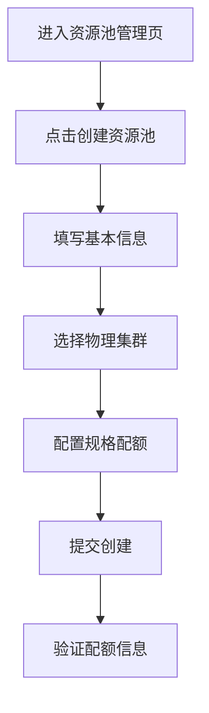
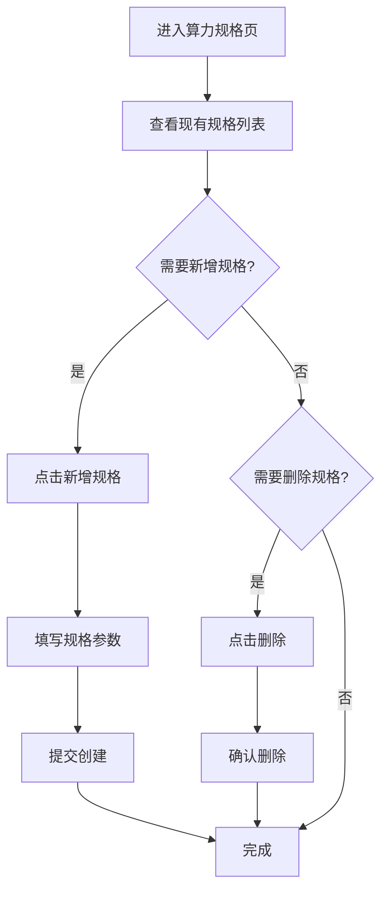
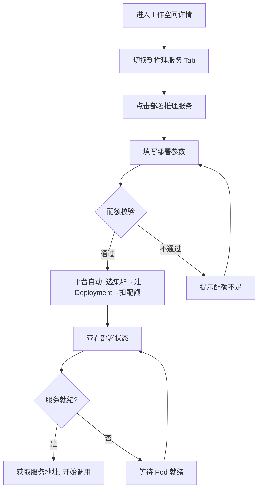
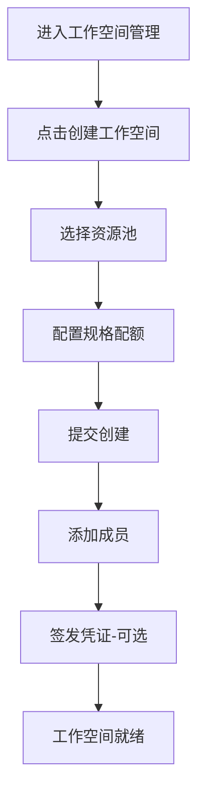

# ACMP 异构算力管理平台 — 用户操作流程文档

> 本文档从 **平台用户操作视角** 描述关键业务流程，覆盖从资源纳管到推理服务上线的完整链路。
> 每个流程标注了对应的 API 接口，方便前后端联调对照。

---

## 流程一：资源池纳管（平台管理员）

### 1.1 流程概述

平台管理员将物理 GPU 服务器纳入平台管理，建立从物理集群到逻辑资源池的映射关系，为后续工作空间和推理服务提供算力底座。

### 1.2 操作步骤



#### 步骤 1：登录平台

- **入口**：浏览器打开平台地址 → 登录页
- **操作**：输入管理员账号密码，点击登录
- **API**：`POST /api/v1/auth/login`

#### 步骤 2：注册物理集群

- **入口**：左侧菜单 → "物理集群" → 点击"注册集群"
- **操作**：
  1. 填写集群名称（如"北京NVIDIA-01"）
  2. 输入集群描述
  3. 粘贴 Base64 编码的 Kubeconfig
  4. 选择 GPU 类型（NVIDIA / 海光DCU / 华为昇腾）
  5. 填写机房位置
  6. 可选：填写节点标签 JSON 和污点配置
  7. 点击"注册"
- **API**：`POST /api/v1/admin/physical-clusters`

#### 步骤 3：查看集群节点

- **入口**：物理集群列表 → 点击集群名称进入详情
- **操作**：查看节点列表，确认 GPU 卡数、CPU/内存容量
- **API**：`GET /api/v1/physical-clusters/{id}/nodes`、`GET /api/v1/physical-clusters/{id}/capacity`

#### 步骤 4：创建逻辑资源池

- **入口**：左侧菜单 → "资源池" → 点击"创建资源池"
- **操作**：
  1. 填写资源池名称（如"算法部资源池"）
  2. 填写部门编码和部门名称
  3. 关联物理集群（可多选，支持异构池）
  4. 添加规格配额：选择算力规格 + 填写总配额数
  5. 点击"创建"
- **API**：`POST /api/v1/admin/resource-pools`

#### 步骤 5：确认资源池状态

- **入口**：资源池列表 → 点击资源池名称进入详情
- **验证**：
  - 资源池状态为"正常"
  - 规格配额显示正确（总配额 / 已分配 / 可用）
  - 关联的物理集群信息正确

---

## 流程二：创建资源池（平台管理员 / 部门管理员）

### 2.1 流程概述

在已有物理集群的基础上，创建面向部门/团队的逻辑资源池，定义可用的 GPU 规格和配额上限。

### 2.2 操作步骤



#### 步骤 1：进入资源池管理

- **入口**：左侧菜单 → "资源池"
- **页面**：展示已有资源池列表，含名称、部门、状态、配额概览

#### 步骤 2：打开创建表单

- **入口**：点击右上角"创建资源池"按钮（仅管理员可见）
- **权限**：PLATFORM_ADMIN 或 ORG_ADMIN

#### 步骤 3：填写基本信息

| 字段 | 说明 | 示例 |
|------|------|------|
| 资源池名称 | 池的显示名称 | 算法部资源池 |
| 描述 | 池的用途说明 | 算法部跨硬件统一资源池 |
| 部门编码 | 组织的唯一编码 | algo |
| 部门名称 | 部门的中文名称 | 算法部 |

#### 步骤 4：选择物理集群

- 下拉框展示所有已注册的物理集群
- 支持多选（多选 = 异构资源池，单选 = 同构资源池）
- 每个选项显示 `集群名称 (GPU类型)`

#### 步骤 5：配置规格配额

- 点击"+ 添加规格配额"添加规格行
- 每行选择：**算力规格**（下拉选择）+ **总配额数**（数字输入）
- 支持添加多个规格（如同时支持 RTX4090 和 DCU）
- 配额数限制该资源池下所有工作空间可使用的该规格最大副本数

#### 步骤 6：提交创建

- 点击"创建"按钮提交
- API：`POST /api/v1/admin/resource-pools`
- 成功提示"资源池创建成功"，列表自动刷新

---

## 流程三：维护资源池规格（平台管理员）

### 3.1 流程概述

平台管理员可以在全局维护算力规格库，包括新增 GPU 规格、查看规格详情、删除过期规格。规格是资源池配额和工作空间部署的基础单位。

### 3.2 操作步骤



#### 步骤 1：进入算力规格管理

- **入口**：左侧菜单 → "算力规格"
- **页面**：展示所有已定义的算力规格表格
- **表格列**：规格名称、显示名称、GPU 品牌、显存大小、创建时间

#### 步骤 2：查看规格列表

- 每个规格显示：
  - `name`：规格标识（如 `nvidia-rtx4090-24g`）
  - `displayName`：显示名称（如"NVIDIA RTX 4090 24GB"）
  - `gpuBrand`：GPU 品牌（NVIDIA / HYGON / HUAWEI_ASCEND）
  - `memoryGb`：显存大小
  - `description`：规格描述

#### 步骤 3：新增算力规格

- **入口**：点击"新增规格"按钮（仅 PLATFORM_ADMIN 可见）
- **操作**：
  1. 填写规格名称（遵循命名规范 `{brand}-{model}-{memory}`）
  2. 填写显示名称
  3. 选择 GPU 品牌
  4. 填写显存大小（GB）
  5. 填写描述（可选）
  6. 点击"创建"
- **API**：`POST /api/v1/specs`

**内置规格参考**：

| 规格名称 | 显示名称 | GPU 品牌 | 显存 |
|----------|----------|----------|------|
| nvidia-a100-80g | NVIDIA A100 80GB | NVIDIA | 80GB |
| nvidia-a100-40g | NVIDIA A100 40GB | NVIDIA | 40GB |
| nvidia-rtx4090-24g | NVIDIA RTX 4090 24GB | NVIDIA | 24GB |
| hygon-dcu-32g | 海光 DCU 32GB | HYGON | 32GB |
| huawei-ascend-910b | 华为昇腾 910B | HUAWEI_ASCEND | 64GB |

#### 步骤 4：删除规格

- **入口**：规格列表 → 点击对应行的"删除"按钮
- **注意**：已被资源池引用的规格无法删除（后端校验）
- **API**：`DELETE /api/v1/specs/{id}`

---

## 流程四：部署推理服务（训练用户 / 推理用户）

### 4.1 流程概述

用户在已创建的工作空间中部署 vLLM 推理服务，平台自动完成配额校验、集群路由、K8s 资源创建。

### 4.2 操作步骤



#### 步骤 1：进入工作空间

- **入口**：左侧菜单 → "工作空间" → 点击目标工作空间进入详情
- **权限**：仅工作空间成员可访问

#### 步骤 2：进入推理服务管理

- **入口**：工作空间详情页 → 点击"推理服务部署" Tab
- **页面**：展示当前工作空间下所有推理部署列表
- **表格列**：名称、模型、状态、GPU 数、副本数、就绪数、服务地址、操作

#### 步骤 3：打开部署表单

- **入口**：点击"部署推理服务"按钮
- **弹出模态框**：vLLM 推理服务部署表单

#### 步骤 4：填写部署参数

| 字段 | 说明 | 必填 | 示例 |
|------|------|------|------|
| 部署名称 | 推理服务标识 | 是 | qwen3-svc |
| 算力规格 | 选择工作空间已分配的规格 | 是 | nvidia-rtx4090-24g |
| 副本数 | Pod 副本数量 | 是 | 1 |
| 模型名称 | 部署的模型标识 | 否 | Qwen3-7B-Instruct |
| 模型来源 | 模型权重来源 | 否 | with_weights |
| 模型路径 | 模型文件路径 | 否 | /models/qwen3 |
| vLLM 镜像 | vLLM 容器镜像 | 否 | vllm/vllm-openai:latest |
| 宿主机模型路径 | 节点上的模型目录 | 否 | /data/models/Qwen3 |

#### 步骤 5：提交部署

- 点击"部署"按钮
- **API**：`POST /api/v1/resource-pools/{poolId}/workspaces/{workspaceId}/model-deployments`
- 平台后台执行：
  1. 校验用户是否为工作空间成员
  2. 校验 workspace.resourcePoolId 与请求 poolId 一致
  3. 加载算力规格信息
  4. **L1 池级配额校验**：池级可用配额是否充足
  5. **L2 工作空间配额校验**：工作空间可用配额是否充足
  6. **配额预扣**：两层级配额同时扣减
  7. **集群路由**：根据规格自动选择目标物理集群
  8. **K8s 资源创建**：生成 Deployment + Service
  9. 失败时自动回滚配额

#### 步骤 6：查看部署状态

- 部署列表自动刷新
- 状态列显示：运行中（绿色）/ 等待中（橙色）/ 失败（红色）
- 就绪列显示当前就绪副本数
- 服务地址列显示集群内访问 URL，支持一键复制

#### 步骤 7：使用推理服务

- 复制服务地址 `http://vllm-{name}-svc.{namespace}.svc.cluster.local:8000`
- 通过该地址调用 vLLM OpenAI 兼容 API

#### 步骤 8：删除部署（可选）

- **入口**：部署列表 → 点击对应行的"删除"按钮 → 确认
- **API**：`DELETE /api/v1/workspaces/{workspaceId}/model-deployments/{id}`
- 平台自动：删除 K8s Deployment/Service → 归还 L1 + L2 配额

---

## 流程五：工作空间管理（平台管理员 / 部门管理员）

### 5.1 流程概述

为团队创建隔离的工作空间，分配资源配额，添加成员，签发 K8s 访问凭证。

### 5.2 操作步骤



#### 步骤 1：进入工作空间管理

- **入口**：左侧菜单 → "工作空间"

#### 步骤 2：创建工作空间

- **入口**：点击"创建工作空间"按钮（仅管理员）
- **操作**：
  1. 填写工作空间名称和描述
  2. 选择所属资源池（下拉选择）
  3. 系统自动加载该池支持的规格列表
  4. 为每种规格设置工作空间最大配额
  5. 设置最大 Pod 数
  6. 点击"创建"
- **API**：`POST /api/v1/workspaces`

#### 步骤 3：添加成员

- **入口**：工作空间详情 → "成员" Tab → "添加成员"
- **操作**：输入用户 ID，点击确认
- **API**：`POST /api/v1/workspaces/{id}/members`

#### 步骤 4：签发凭证

- **入口**：工作空间详情 → "凭证" Tab → "签发凭证"
- **操作**：输入用户名和有效期天数，点击签发
- **API**：`POST /api/v1/admin/workspaces/{workspaceId}/issue-credential`
- 返回：Kubeconfig 文件内容，可直接分发给用户

---

## 流程六：提交训练任务（训练用户）

### 6.1 流程概述

用户在工作空间中提交 Volcano 训练任务，平台自动完成配额校验和集群调度。

### 6.2 操作步骤

#### 步骤 1：进入工作空间详情

- 同上流程四步骤 1

#### 步骤 2：打开训练任务表单

- **入口**：工作空间详情 → "训练任务" Tab → "提交训练任务"

#### 步骤 3：填写任务参数

| 字段 | 说明 | 示例 |
|------|------|------|
| 任务名称 | Volcano Job 名称 | qwen3-finetune-01 |
| 镜像 | 训练容器镜像 | registry.local/training:torch-2.1 |
| 副本数 | 训练 Worker 数量 | 2 |
| 算力规格 | GPU 规格 | nvidia-rtx4090-24g |
| 命令 | 训练启动命令 | python train.py --epochs 3 |

#### 步骤 4：提交任务

- **API**：`POST /api/v1/workspaces/{workspaceId}/training-jobs`
- 走与推理部署相同的"规格→双层配额→K8s"路径

---

## 附录：角色权限速查

| 操作 | PLATFORM_ADMIN | ORG_ADMIN | TRAINING_USER | INFERENCE_USER |
|------|:---:|:---:|:---:|:---:|
| 注册物理集群 | ✅ | ❌ | ❌ | ❌ |
| 创建/删除算力规格 | ✅ | ❌ | ❌ | ❌ |
| 创建资源池 | ✅ | ✅ | ❌ | ❌ |
| 查看资源池 | ✅ | ✅ | ❌ | ❌ |
| 创建工作空间 | ✅ | ✅ | ❌ | ❌ |
| 管理成员 | ✅ | ✅ | ❌ | ❌ |
| 签发凭证 | ✅ | ❌ | ❌ | ❌ |
| 查看工作空间 | ✅ | ✅ | ✅(成员) | ✅(成员) |
| 部署推理服务 | ✅ | ✅ | ✅(成员) | ✅(成员) |
| 提交训练任务 | ✅ | ✅ | ✅(成员) | ❌ |
| HAMi GPU 配置 | ✅ | ❌ | ❌ | ❌ |

---

## 附录：完整操作路径总览

```
1. 管理员登录
   └─ POST /api/v1/auth/login

2. 注册物理集群（纳管）
   ├─ POST /api/v1/admin/physical-clusters
   ├─ GET  /api/v1/physical-clusters
   ├─ GET  /api/v1/physical-clusters/{id}/capacity
   └─ GET  /api/v1/physical-clusters/{id}/nodes

3. 维护算力规格
   ├─ POST   /api/v1/specs
   ├─ GET    /api/v1/specs
   └─ DELETE /api/v1/specs/{id}

4. 创建资源池
   └─ POST /api/v1/admin/resource-pools

5. 创建工作空间
   ├─ POST   /api/v1/workspaces
   ├─ GET    /api/v1/workspaces
   ├─ POST   /api/v1/workspaces/{id}/members
   └─ POST   /api/v1/admin/workspaces/{id}/issue-credential

6. 部署推理服务
   ├─ POST   /api/v1/resource-pools/{poolId}/workspaces/{workspaceId}/model-deployments
   ├─ GET    /api/v1/workspaces/{workspaceId}/model-deployments
   └─ DELETE /api/v1/workspaces/{workspaceId}/model-deployments/{id}

7. 提交训练任务
   └─ POST /api/v1/workspaces/{workspaceId}/training-jobs
```
